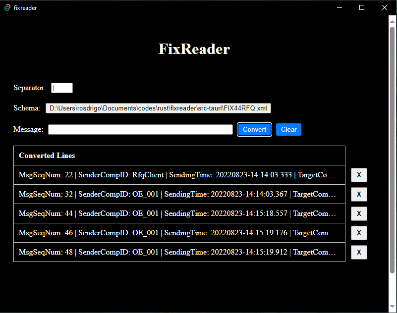
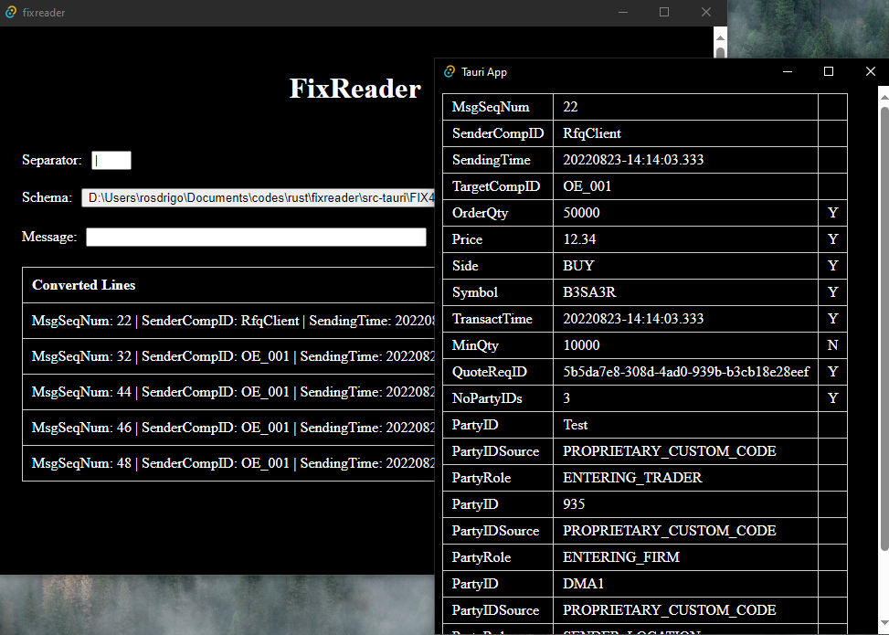

# Leitor Fix em Rust
Tela simples utilizando Tauri como tela para decodificar mensagens do protocolo fix.

 

### A fazer
- [x] testar com outros xml
- [x] pesquisar por campos agrupados 
- [x] ler mensagem via terminal
- [x] ajustar o print
- [x] validar campos obrigatórios
- [x] CLI
- [x] separar schema para um arquivo
- [x] GUI - Tauri
- [x] Schema ser movido pro context
- [x] Preencher na tela o xml carregado
- [x] Carregar xml via config.json
- [x] Dialogo pra carregar outro xml
- [x] Setar separador na tela
- [x] Abrir detalhes da linha
- [x] Ajustar abrir xml
- [ ] validar header e trailer
- [ ] bug: tela detalhes se afetando