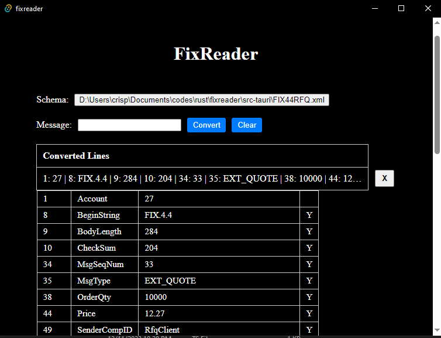

# Leitor Fix em Rust
Tela simples utilizando Tauri como tela para decodificar mensagens do protocolo fix.

## Release
Uma versão teste está disponível na seção [release](https://github.com/crispim1411/fixreader/releases)